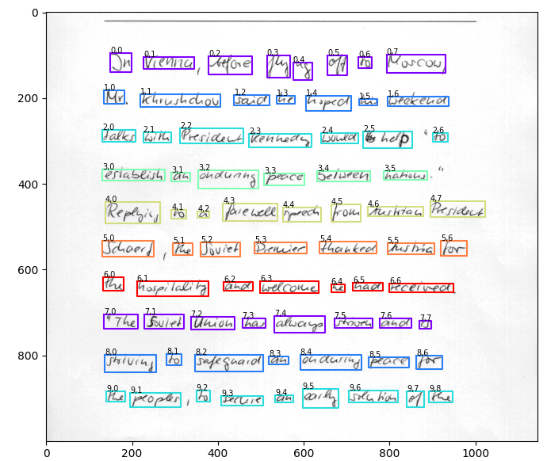

# Scale space technique for Word Segmentation
This implementation is based on the research named [**Scale Space Technique for Word Segmentation in Handwritten Documents**](http://ciir.cs.umass.edu/pubfiles/mm-27.pdf).
The target is to segment words in an image.
Here is an example.



## Installation

Install dependant packages.

```angular2html
pip install requirements.txt
```

## Usage
### Simple usage
Run `python main.py` to see how word segmentation works.
List of arguments:
* `data (default='./data/page')`: Path to folder contains list of image
* `kernel_size (default=25)`: Size of Gaussian kernel (must be an odd number)
* `sigma (default=11)`: Standard deviation of Gaussian filter (low-pass filter) kernel
* `theta (default=5)`: Ratio between width / height of words
* `min_word_area (default=100)`: Minimal area for a word
* `resize_height (default=1000)`: Resize height

Example usage:
```angular2html
python main.py --data ./data/page --resize_height 1000
python main.py --data ./data/line --resize_height 50  --theta 7
```

### Use with the dataset
* Download files `data/forms` and `data/ascii` [**IAM Handwriting Dataset**](https://fki.tic.heia-fr.ch/databases/download-the-iam-handwriting-database).
* Extract the zip files and move `data/forms` and `data/ascii/words.txt` to `data` folder of the project.
* Create `data/preprocessed-forms` folder.
* Run `python utils.py` to pre-process the dataset.
* Run `python main.py --data ./data/preprocessed-forms` to predict on the dataset.

### Evaluation
Run `python evaluations.py` to evaluate the results based on **the Intersection Over Union (IOU)** score of the dataset. Note that the dataset must be download first to run this evaluation.

## Source tree explaination
* `data`: Folder contains examples and the dataset
* `models`: Folder contains list of hyper-parameters
* `visualizations`: Folder contains some visualizations
* `main.py`: The command line API for the algorithm
* `word_segmentation.py`: Implement the main part of the algorithm
* `evaluations.py`: Evaluate the results based on IOU score
* `constants.py`: List of constants
* `entities.py`: List of class entities
* `utils.py`: Utilities functions
* `visualization.jpynb`: Demo notebook
